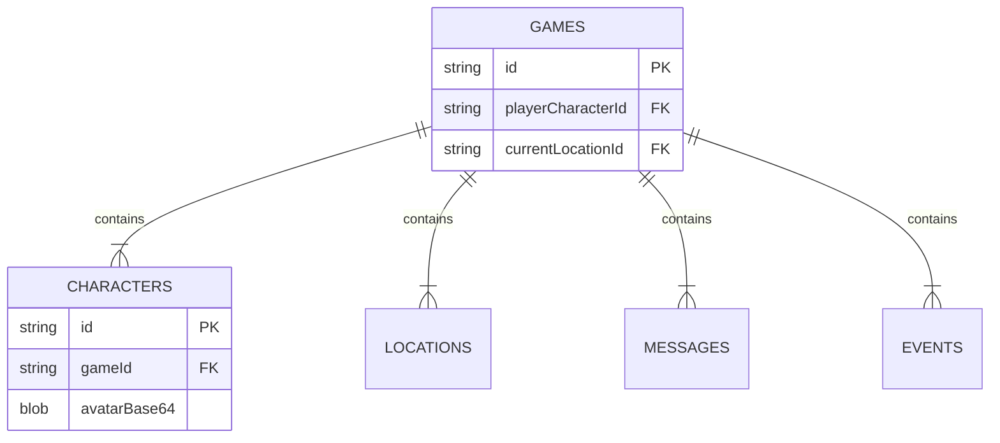

# Estrutura do Banco de Dados (IndexedDB)

O storywell.games utiliza uma abordagem **Relacional** dentro do **IndexedDB**.
Apesar de ser um banco NoSQL, estruturamos os dados com chaves estrangeiras (`gameId`) para manter a integridade e escalabilidade.

**Nome do Banco:** `InfinitumRPG_Core`
**Versão:** `2`

---

## 📂 Object Stores (Tabelas)

### 1. `games`
Armazena os metadados da sessão. É a "cabeça" do save.
*   **KeyPath:** `id` (String - Timestamp)
*   **Campos:**
    *   `title`: Nome da campanha.
    *   `turnCount`: Número de turnos.
    *   `lastPlayed`: Timestamp.
    *   `config`: Objeto JSON com configurações (idioma, tema).
    *   `playerCharacterId`: Ponteiro para a tabela `characters`.
    *   `currentLocationId`: Ponteiro para a tabela `locations`.

### 2. `characters`
Armazena todos os NPCs e o Jogador.
*   **KeyPath:** `id` (String - UUID ou Slug)
*   **Índices:**
    *   `by_game_id`: Indexa campo `gameId`.
*   **Campos Importantes:**
    *   `gameId`: FK ligando ao jogo.
    *   `inventory`: Array de Strings.
    *   `stats`: Objeto JSON (HP, MP).
    *   `relationships`: Mapa de afinidade.
    *   `avatarBase64`: String longa com a imagem PNG codificada.

### 3. `locations`
Armazena o mapa do mundo.
*   **KeyPath:** `id` (String)
*   **Índices:**
    *   `by_game_id`: Indexa campo `gameId`.
*   **Campos Importantes:**
    *   `gameId`: FK ligando ao jogo.
    *   `connectedLocationIds`: Array de IDs de outros locais.
    *   `backgroundImage`: String base64 com imagem de fundo gerada por DALL-E 3 (opcional).

### 4. `messages`
O log de chat. Pode crescer muito, por isso está separado.
*   **KeyPath:** `id` (String - Timestamp_Index)
*   **Índices:**
    *   `by_game_id`: Indexa campo `gameId`.
*   **Campos:**
    *   `gameId`: FK.
    *   `senderId`: Quem enviou.
    *   `text`: O conteúdo.
    *   `type`: DIALOGUE, NARRATION ou SYSTEM.

### 5. `events`
Log semântico para RAG (Retrieval Augmented Generation).
*   **KeyPath:** `id`
*   **Índices:**
    *   `by_game_id`: Indexa campo `gameId`.
*   **Campos:**
    *   `description`: Resumo do que aconteceu.
    *   `importance`: Peso do evento.

---

## 🔗 Diagrama de Relacionamento Lógico

## ⚙️ Fluxo de Leitura/Escrita

1.  **Carregar Jogo (`loadGame`):**
    *   O sistema busca 1 registro em `games`.
    *   Usa o ID desse jogo para fazer um `getAll(ID)` nas outras 4 tabelas simultaneamente.
    *   Monta um objeto `GameState` gigante na memória RAM para o React renderizar.

2.  **Salvar Jogo (`saveGame`):**
    *   O sistema abre uma transação `readwrite` que engloba as 5 tabelas.
    *   Itera sobre os arrays da memória e insere/atualiza (`put`) cada registro em sua respectiva tabela.
    *   Isso garante que se o navegador fechar no meio, o banco não corrompe (ACID properties do IndexedDB).
