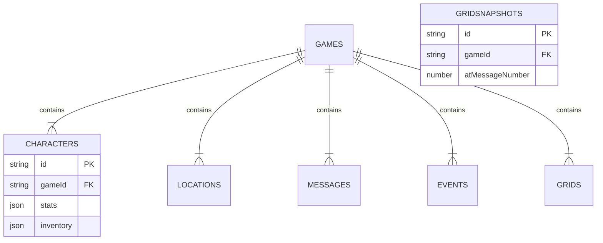

# Estrutura do Banco de Dados (IndexedDB)

**Banco:** `InfinitumRPG_Core` · **DB_VERSION:** 3 · **Última atualização:** 13/12/2025

O storywell.games segue o padrão **Data Mapper**: o `GameState` usado pelo React é desidratado em múltiplas object stores do IndexedDB e remontado quando um save é carregado. Isso mantém o app responsivo mesmo com milhares de mensagens e snapshots de grid.

---

## 1. Object Stores

| Store | KeyPath | Índices | Conteúdo principal |
| --- | --- | --- | --- |
| `games` | `id` | — | Metadados: `title`, `turnCount`, `lastPlayed`, `config`, ponteiros (`playerCharacterId`, `currentLocationId`). |
| `characters` | `id` | `by_game_id` | Jogador + NPCs com `stats`, `inventory: Item[]`, `relationships`, `avatarBase64`, `state`. |
| `locations` | `id` | `by_game_id` | Grafo de locais, `connectedLocationIds`, descrições, `backgroundImage`. |
| `messages` | `id` | `by_game_id` | Chat completo (`ChatMessage`), ordenado por timestamp e sanitizado contra duplicatas. |
| `events` | `id` | `by_game_id` | `GameEvent` com `description`, `importance`, `turn`. Base para resumos futuros. |
| `grids` | `id` | `by_game_id` | `GridSnapshot`: localização, `atMessageNumber`, timestamp e posições (x,y) de player/NPCs.

> **Inventário estruturado:** desde a migração para `Item[]`, cada registro em `characters.inventory` contém `category`, `quantity`, `effects`, `stackable`, etc. Os prompts e UI usam `utils/inventory.ts` para formatar/validar esses dados.

---

## 2. Fluxo de escrita (`saveGame`)

1. `useGameEngine` chama `dbService.saveGame(gameState)` após cada turno.
2. O serviço abre uma transação `readwrite` envolvendo todas as stores.
3. O objeto `GameState` é desestruturado:
   - `metaData` vai para `games` (sem `characters`, `locations`, `events`, `gridSnapshots`).
   - Cada personagem recebe `gameId` e é salvo individualmente.
   - Mensagens passam por `sanitizeMessages` para remover duplicidades e normalizar `pageNumber`.
   - Snapshots do grid são salvos com `gameId` e mantidos ordenados por `atMessageNumber`.
4. Em caso de erro a transação é revertida automaticamente, preservando consistência.

---

## 3. Fluxo de leitura (`loadGame`)

1. `dbService.loadGame(id)` abre transação `readonly` e busca o registro em `games`.
2. Em paralelo (`Promise.all`), coleta todos os registros nas demais stores usando `index('by_game_id').getAll(id)`.
3. Reconstroi `characters`, `locations`, `events`, `gridSnapshots` como mapas (O(1) para lookup).
4. Ordena mensagens e grids por timestamp/`atMessageNumber`, reexecuta `sanitizeMessages` e retorna o `GameState` hidratado.
5. Se encontrar duplicidades no log, salva automaticamente o estado limpo em background.

---

## 4. Diagrama lógico

---

## 5. Exportação / Importação

- `dbService.exportGame(id)` produz `{ version: EXPORT_VERSION, exportedAt, game }` pronto para compartilhamento.
- `dbService.importGame(file)` valida a versão, normaliza IDs e reusa a mesma rotina de `saveGame`.

---

## 6. Boas práticas

- **Atualize DB_VERSION** sempre que adicionar nova store ou alterar o shape dos dados. O `onupgradeneeded` garante criação de índices ausentes.
- **Evite dados derivados** nas stores; cálculos como `healthPercent` são feitos em runtime.
- **Limpeza periódica:** campanhas longas podem acumular centenas de snapshots; considerar políticas de retenção (ex.: armazenar apenas a cada N turnos) quando `gridSnapshots` ultrapassar limites definidos no app.
